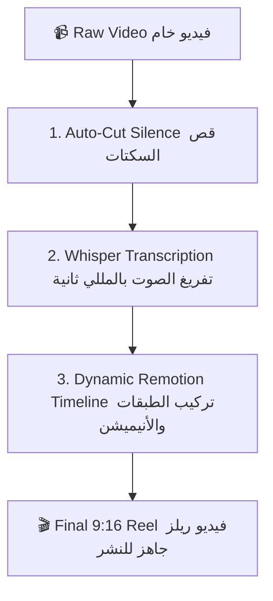

# 🎬 Reel Agent Skill (AI Automated Video Editor)

<div align="center">


**أداة ومهارة ذكاء اصطناعي (AI Agent Skill) للمونتاج التلقائي لفيديوهات الريلز، تيك توك، ويوتيوب شورتس.**
<br />
*Automate Silence Removal (Jump-Cuts), Kinetic Word-Level Subtitles, Glassmorphic Explainer Cards, and 60FPS 9:16 Video Rendering.*

</div>

---

## 🌟 الميزات الأساسية (Key Features)

- ✂️ **قص السكتات التلقائي (Auto Jump-Cuts):** يكتشف فترات الصمت ويحذفها تلقائياً للحصول على إيقاع سريع (Fast-Paced).
- 🎙️ **كابشنز تفاعلية متحركة (Kinetic Subtitles):** يستخرج الكلام بدقة المللي ثانية عبر **Whisper**، ويلون الكلمة المنطوقة مع تكبيرها وإضافة إيموجي تلقائي.
- 💡 **كروت وشاشات توضيحية (Glassmorphic Info Cards):** ظهور كروت أنيقة بانتقالات ناعمة لشرح المفاهيم أو الأكواد.
- 📐 **أبعاد 9:16 بجودة 60FPS:** رندر عالي الجودة متوافق مع إنستغرام وتيك توك.
- 📊 **شريط تقدم متفاعل (Dynamic Progress Bar):** لزيادة نسبة إكمال المشاهدين للفيديو.
- 🤖 **AI Agent Native:** مصمم ليعمل كـ **Skill** يستدعيه الـ AI Agent (Antigravity, Claude, OpenCode, Codex) بضغطة زر.

---

## 🔄 مسار العمل (How the Workflow Works)



1. **التقطيع:** يقوم `scripts/cut_silence.py` بتحليل الترددات الصوتية وقص الصمت وتصدير فيديو مقصوص.
2. **الكابشنز:** يقوم `scripts/transcribe.py` بربط كل كلمة بتوقيت ظهورها بالمللي ثانية وإضافة الإيموجيز المناسبة.
3. **الرندر:** يقوم `Remotion` بتركيب طبقات الفيديو، التكبير البصري (Zoom-in)، الكرت التوضيحي، وحرق الكابشنز بدقة 1080x1920 بمعدل 60 إطار في الثانية.

---

## 🚀 التثبيت والتشغيل (Quick Start)

### 1. المتطلبات (Prerequisites)
- [Node.js](https://nodejs.org/) (v18+)
- [Python](https://python.org/) (v3.9+)
- [FFmpeg](https://ffmpeg.org/) (مثبت ومضاف للـ PATH)

### 2. تثبيت الحزم (Installation)

```bash
# تثبيت حزم البايثون
pip install -r requirements.txt

# تثبيت حزم Remotion و React
npm install
```

---

## 💻 الاستخدام (Usage)

### تشغيل البايبلاين بالكامل (Full Pipeline):

```bash
python scripts/pipeline.py \
  --input "path/to/raw_video.mp4" \
  --output "output/final_reel.mp4" \
  --title "شرح احترافي" \
  --card-text "الذكاء الاصطناعي يصنع فيديوهات بالكامل!" \
  --card-start 2.5 \
  --highlight-color "#FFE600"
```

### المعاينة المباشرة (Live Preview):
لمعاينة الفيديو والتعديل على العناصر والأنيميشن في المتصفح لحظياً:
```bash
npm start
```

---

## 🤖 كيف يستخدمه الـ AI Agent؟

عند إضافة هذا المجلد كـ **Skill** للـ AI Agent (داخل `.agents/skills/reel-agent-skill` أو مساحة العمل):
يمكنك فقط أن تقول للـ Agent في الشات:
> *"سويلي ريلز احترافي للفيديو `raw.mp4`، وضفلي كرت توضيحي بالثانية 3 يشرح فكرة المشروع"*

وسيقوم الـ Agent بتنفيذ السكربتات وتوليد الفيديو النهائي فوراً!

---

## 📄 License
MIT License © [Aliw02](https://github.com/Aliw02)
