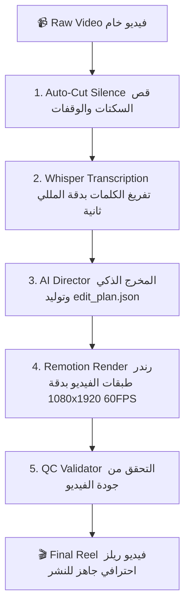

# 🎬 AI Reel Editor Pro (Reel Agent Skill)

<div align="center">


**محرر ومخرج فيديو ذكي متكامل (AI Video Director & Editor) لإنتاج فيديوهات ريلز، تيك توك، ويوتيوب شورتس 9:16 تلقائياً بأعلى جودة.**
<br />
*Autonomous Silence Removal, Faster-Whisper Arabic Transcription, AI Director Edit Planning, Kinetic RTL Typography, Dynamic Punch Zooms, Multi-Overlay Timeline, Audio Ducking, and QC Validator.*

</div>

---

## 🌟 الميزات الأساسية (Key Features)

- ✂️ **قص السكتات التلقائي الذكي (Speech-Aware Silence Trimming):** حذف فترات الصمت الميتة مع الحفاظ على وتيرة التنفس والوقفات الدرامية للمتحدث.
- 🎙️ **تفريغ دقيق باللغة العربية واللهجات (Faster-Whisper):** يدعم اللهجة العراقية والعربية الفصحى مع توحيد الأحرف وتقطيع الجمل المعنوية حسب الوقفات وعلامات الترقيم.
- 🧠 **المخرج الذكي (AI Director / Edit Planner):** تحليل دلالي للنص وتوليد خطة مونتاج متكاملة (`edit_plan.json`) تحدد نقاط الجذب (Hooks)، حركات الزووم التكتيكي، والبطاقات التوضيحية.
- 📐 **طباعة عربية وتوافق RTL كامل:** دعم اتجاه اليمين لليسار (`direction: rtl`) وعزل النصوص ثنائية الاتجاه مع خطوط Google Fonts (Cairo, Tajawal, Readex Pro) و 5 ثيمات مظهرية (`box_glass`, `neon`, `bold_yellow`, `clean_white`, `cyber`).
- 🔍 **زووم تفاعلي ذكي (Punch-in Smart Zooms):** حركات تقريب ديناميكية عند الكلمات المفتاحية والأرقام لرفع نسبة المشاهدة والتفاعل.
- 🎴 **نظام الطبقات المتعددة (Multi-Overlay Timeline):** بطاقات زجاجية، اقتباسات، إحصائيات ونسب، قوائم نقطية، وأكواد برمجية.
- 🎵 **محرك الصوت والـ Audio Ducking:** خفض صوت الموسيقى الخلفية تلقائياً أثناء كلام المتحدث ورفعها أثناء الوقفات.
- 🛡️ **فحص الجودة الآلي (Quality Control Validator):** فحص تلقائي بعد الرندر للتأكد من أبعاد 1080x1920، عدد الفريمات، ومزامنة الصوت.

---

## 🔄 مسار العمل (How the Workflow Works)



---

## 🚀 التثبيت والتشغيل (Quick Start)

### 1. المتطلبات (Prerequisites)
- [Node.js](https://nodejs.org/) (v18+)
- [Python](https://python.org/) (v3.9+)
- [FFmpeg](https://ffmpeg.org/) (مثبت ومضاف للـ PATH)

### 2. تثبيت الحزم (Installation)

```bash
# تثبيت حزم البايثون
pip install -r requirements.txt

# تثبيت حزم Remotion و React
npm install
```

---

## 💻 الاستخدام (Usage)

### تشغيل البايبلاين بالكامل (Full Autonomous Pipeline):

```bash
python scripts/pipeline.py \
  --input "path/to/raw_video.mp4" \
  --output "output/final_reel.mp4" \
  --title "سر الذكاء الاصطناعي" \
  --theme "box_glass" \
  --whisper-model "turbo" \
  --lang "ar" \
  --fps 60
```

### خيارات الـ CLI المتاحة:
- `--input`: مسار الفيديو الأصلي (إجباري).
- `--output`: مسار حفظ الفيديو النهائي الممنتج (افتراضي: `output/final_reel.mp4`).
- `--title`: عنوان الهوك الافتتاحي في بداية الفيديو.
- `--theme`: نمط الخط والكابشنز (`box_glass`, `neon`, `bold_yellow`, `clean_white`, `cyber`).
- `--whisper-model`: موديل Whisper (`base`, `small`, `medium`, `large-v3`, `turbo`).
- `--lang`: لغة الصوت (`ar`, `en`, `auto`).
- `--bgm`: مسار ملف موسيقى خلفية لتفعيل ميزة الخفض التلقائي أثناء الكلام (Audio Ducking).
- `--fps`: معدل الإطارات (30 أو 60).
- `--skip-qc`: تخطي مرحلة فحص الجودة بعد الرندر.

### المعاينة المباشرة (Live Interactive Studio):
لمعاينة الفيديو والطبقات والتفاعل مع التايملاين عبر المتصفح:
```bash
npm start
```

---

## 🤖 تكامل الـ AI Agents

مصمم ليعمل كـ **Skill** يستدعيه أي وكيل ذكاء اصطناعي (Antigravity, Claude, OpenCode, Codex):
> *"سويلي ريلز احترافي للفيديو `input.mp4` بثيم النيون مع كروت توضيحية"*

---

## 📄 الترخيص (License)
MIT License © [Aliw02](https://github.com/Aliw02)
